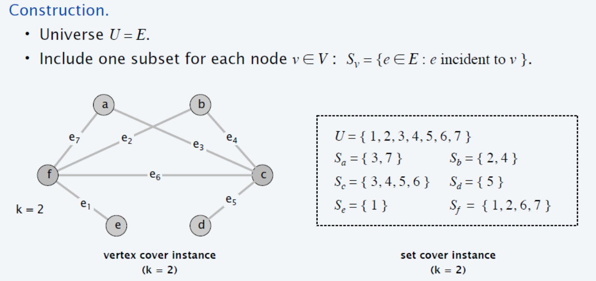

# AMP-2

## Contents

[NP Complete](#NP-Complete)


## NP Complete

### Definition

*Definition of P*

 질문자체에 대해서 예 혹은 아니오로 다항식 시간안에 답할 수 있는 문제

> The class of problems that can be decided in polynomial time

*Definition of NP* 

 예라는 근거가 주어졌을 때 그것이 Yes임을 다항식 시간안에 확인 할 수 있는 문제 

> 1. Set of decision problems so that for any yes instance, it has a verifiable proof so that with the proof, one can be verify that the instance is yes in a polynomial time by a Turing machine.
> 2. Set of decision problems that can be solved by a Non-deterministic TM (NTM) in a polynomial time of the input bit size.

*Definition of NP-hard*

 Np-hard는 이 집합에 속한 문제들 대해서 서로 다항식 시간 변환[^1]이 가능한 문제 집합이다.

> If we could solve this problem in polynomial time, we could solve all NP problems in polynomial time


*Definition of NP-Complete*

 Np 이고 Np hard 를 만족하는 문제. 따라서, 이중 하나의 문제라도 polynomial time안에 풀린다는 것을 증명하면 Np-hard에 속한 모든 문제가 polynomial time안에 풀린다.

풀어서 말하면, 지금까지의 기술로는 다항시간에 풀기 어렵다고 판단되면서, 서로 밀접한 논리적 연결관계를 가진 문제들의 집합이다. 

왜 중요한가? **어떤 문제의 최적해와 유사한 decision version(Yes or No question)에 대한 문제를 푸는 알고리듬**을구하면 **그 문제와  reduction 할 수 있는 문제도 풀수 있게 되므로**, 최대한 많은 NP complete 연결고리를 찾는 것이 좋다. 

> The set of NP-complete problems are all problems in the complexity class NP for which it is known that if any one is solvable in polynomial time, then they all are. 
>
> conversely, if any one is not solvable in polynomial time, then none are.


[^1]: 다항식 시간 변환은 변환이 다항식 시간안에 이루어지고 두 사례의 답의 존재성(Yes or No)이 일치하는 문제이다


### SAT

 **Problem:** 논리곱 정규형(CNF(Nonjunctive Normal Form))의 부울 식이 주어졌을 때 그 식을 만족하는 변수를 찾는 문제

> *Cook-Levin Therom* 
>
> SAT 문제는 NP complete이다.  

**3-SAT is NP:**  Since for any yes instance (satisfiable CNF formula), there is a proof (satisfying assignment) so that with this proof a polynomial time algorithm (that checks whether the given assignment makes the CNF formula to be true) can confirm that the instance is a yes case.


### Clique

**Problem:** 그래프 $G = (V,E)$ 에서 size $k$짜리 Clique[^2] 가 존재하는가

**Clique is NP: ** clique인 subgraph에서 모든 pair의 vertices가 연결이 되어있는가 $O(N^2)$ 안에 확인 가능 (vertice 수를 $N$ 이라 하면)
**Clique is Np-hard 증명 [그림 및 detail](https://opendsa-server.cs.vt.edu/ODSA/Books/Everything/html/threeSAT_to_clique.html)  **

> 일단, NP-hard 집합의 개념 이해 필요!  NP-hard 어떤 문제를 polynomal 안에 풀수 있다면(진짜 풀 수있는지는 모름), (NP-hard 안의 모든 문제들 사이에서 polynomial time 안에 변환이 가능해서)NP-hard안에 있는 모든 집합의 문제들이 전부 polynomial 안에 풀릴 수 있는 문제들의 모임. 
>
> if 3-SAT $\le_p$ Clique (3-SAT is reducible to Clique), Clique is NP-hard  (3-SAT 는 어려운 문제고, reduction algorithm 에 의해 3-SAT를 Clique로 변환가능한데, 이게 만약 polynomial 안에 풀리면, 3-SAT, Clique 모두 polynomial time안에 풀 수 있는 것임). 따라서, polynomial reduction 알고리즘과 $\Leftrightarrow$ 관계를 설명해야 함

**Reduction  algorithm:** 어떤 한 3-SAT인 boolean equation $\Phi$ 가 주어졌을때, 각각의 literal 에 대해서 vertex를 만들고, 자기가 속한 clause의 literal과 다른 clause에서의 negation을 제외한 나머지 에 대해서 edge를 만든다. ($\Phi$ 안에 총 m 개의 clause가 있다면 m개의 clauter 가 생김). 이 과정은 $O(N^p)$ 걸림.

(여기서 알수있는 intuition은 각 생성된 graph의 vertex가 연결되 있다면, 그에 대응하는 literal 쌍은 동시에 True)

**3-SAT $\Rightarrow $  k-Clique:** 3-SAT가 satisfiable하면(각 clause 마다 적어도 하나의 literal이 True, 게다가 negation은 연결하지 않았음), (각기 다른 clause 에서 파생된 vertex는 반드시 연결되어 있기 때문에) clause의 수(m=k) 사이즈의 clique이 있을 수 밖에 없다. 

**k-Clique $\Rightarrow$ 3-SAT:** k-Clique가 그래프에 있다면, (k개의 cluster에서 하나씩의 vertex가 연결이 되어 있어서 그에 대응되는 clause의 literal이 모두 True가 되므로)  $\Phi$는 satisfiable하다.


[^2]: 그래프에서 어떤 pair의 vertices 라도 connected 되어 있는 sub graph의 vertex set


### Independent Set

**Problem:**  graph $G$ 에서 size $k$ 짜리 IS[^3] 가 존재하는가

**IS is NP: ** IS set에서 모든 pair의 vertices가 연결이 되어있는가 $O(V^2)$ 안에 확인 가능

**IS is Np-hard 증명**

**Reduction algorithm**:  graph $G = (V, E)$ 가 주어졌을때, graph의 edge에 대해 complement 연산을 수행하면 

$\bar{G} = (V, \bar{E})$ 가 되는데 이 연산은 모든 vertex pair에 대해 edge가 존재하는지 확인하고 있다면 삭제하고, 없으면 새로 edge를 만드는 작업이므로 $O(V^2)$ 이 걸림

**Clique $\Rightarrow $ IS:** clique set 이 size $k$ 짜리 $A$ 라고 하고, graph를 complement를 했을때,  $A$ 의 원소인 vertex들 사이의 edge가 존재하지 않으므로 $A$ 는 size $k$ 짜리 IS가 됨 

**IS $\Rightarrow $ Clique:**  IS set 이 size $k$ 짜리 $A$ 라고 하고, graph를 complement를 했을때,  $A$ 의 원소인 vertex들 사이의 edge가 항상 존재하므로 $A$ 는 size $k$ 짜리 clique가 됨 


[^3]: IS(Indpendent Set)의 정의는 graph $G$ 가 주어졌을때, 서로간의 edge가 전혀 없는 vertex set (Clique의 반대)


### Vertex Cover

**Problem:** graph $G$ 에서 size $k$ 인 Vertex Cover[^4]가 존재하는가에 대한 문제

**Vertex Cover is NP: ** size $k$ 의 VC 가 주어지면, graph $G$ 의 모든 edge $(u,v)$ 마다 size $V'$의 VC set 안에 $u,v $ 둘중 하나가 포함되어있나 확인, 따라서, polynomial time 이 걸린다. naive한 알고리즘의 예로, $O(EV') = O(EV)$ 

```python
#given G.E, V' in VC set,
for (u,v) in G,E 
	for k in V' 
		if k == u or k == v 
			pass
        else 
        	return False
return True 
```

**Vertex Cover is Np-hard 증명**

**Reduction algorithm**:  graph $G = (V, E)$ 가 주어졌을때, graph의 edge에 대해 complement 연산을 수행하면 

$\bar{G} = (V, \bar{E})$ 가 되는데 이 연산은 모든 vertex pair에 대해 edge가 존재하는지 확인하고 있다면 삭제하고, 없으면 새로 edge를 만드는 작업이므로 $O(V^2)$ 이 걸림


**Clique $\Rightarrow $ VC:**  주목할점: $k-clique \Rightarrow |V|-k$ size 의 $VC$ 

만약 주어진 graph $G$ 에  $k-clique$ set $A \sub V$와 graph의 complement 연산을 한 $\bar{G}$ 가 있다고 하자. 

만약 $(u,v) \notin E$ 이면, $u,v$ 둘중 하나는 반드시 $V-A = V'$  에 속한다. 따라서 $V'$ set 이 Vertex Cover set이 되고, size는 $|V|-k$ 짜리 가 된다. 

**VC $\Rightarrow $ Clique:**  주목할점: $|V|-k$ size 의 $VC$ $\Rightarrow k-clique$  

만약 $u,v \notin V'$ 이면, $(u,v)\in E$ 이므로 $V-V'= A$는 Clique set 이다. 


[^4]: undirected 그래프에서 모든 간선의 양 끝점을 포함하는 정점들의 집합들 중 최소의 집합(optimal vertex cover)을 찾는 것. 즉, 어떤 edge를 선택하더라도, edge pair중 적어도 하나의 vertex가 포함되도록 하는 집합


### Set Cover

**Problem:** 말 보다 수식으로 표현하는게 더 쉽다.  
$$
A \supset C \supset C'\text{with size k } \\
\text{FIND } C'\text{s.t } \underset{S_i \in C'}{\cup}S_i = A
$$
**SC is NP:** naive 하게 생각해보면 주어진 C'를 가지고 $\underset{S_i \in C'}{\cup}S_i = A$ 이 되는지 확인하면 된다. A에 있는 모든 원소수가 n 개라고 가정하고, 집합 C'의 원소 집합 $S_*$수를 m개 라고하면 $O(nm)$이므로 polynomial time이 걸림

**SC is NP-hard**

**Reduction algorithm:** 

size $k$ 짜리 Vertex Cover instance가 graph $G =(V, E)$에 있을때, 이를 어떻게 Set Cover 문제로 바꾸고, 어떤 instance를 만드는지에 대해 설명하겠다. 

Set Cover에서 커버할 모든 원소는 graph $G$의 모든 edge $E$로 한다. 따라서, 커버할 set $A = E$가 됨.

또, $C'$ 의 각 원소집합 $ S_i $는 graph $G$에서 $v_i$ 에 incident한 edge들로 구성된다.    

(G에서 전체 edge를 scan하여 A를 만들고, 각각의 vertex마다 incident한 edge를 check하는것은 polynomial time이 걸림 )

이렇게 변환된 Set Cover 문제의 size $k$는 Vertex Cover size $k$ 와 동일하다. (왜 그런지는 증명을 보면 됨)



**VC$\Rightarrow $ SC:** VC set의 정의는 모든 edge 에서 한쪽 정점은 반드시 VC set에 걸쳐 있다. 따라서 Vertex Set에 속한 k 개의 정점들 $v_i|_{i=1,..,,k}$에 대해 대응된 k개의  $S_i|_{i=1,..,k}$ 들만 골라서 union하면 모든 edge 원소들 A를 커버하게 된다. 

**SC $\Rightarrow $ VC:** Set Cover의 instance에서 A를 cover하는 k개의 $S_i|_{i=1,..,k}$에 대응된 vertex들 $v_i|_{i=1,..,,k}$ 집합이 VC set 을 이룬다. 왜냐하면 $S_i|_{i=1,..,k}$ 가 A를 커버한다는것은 모든 edge E를 커버한다는 것이고, S_i 는 v_i에 incident 한 vertex set으로 이루어졌으므로,  $v_i|_{i=1,..,,k}$ 역시 모든 edge를 커버하기 때문에, edge에서 정점 2개중 하나는 반드시 $v_i|_{i=1,..,,k}$에 포함된다.


### Hamiltonian Path

**Problem:** <u>directed graph</u>.에서 모든 vertices 를 한번씩만 방문하는 path(Hamiltonian path)가 있는가 (cycle도 비슷하다.)

**[HAMPATH is NP](https://www.geeksforgeeks.org/proof-hamiltonian-path-np-complete/): **어떤 graph에서 HAMPATH 가 주어지면, 그것은 서로 다른 vertex sequence인데, 각각의 연속된 정점 간의 edge 가 graph에 있는지 확인하는데 polynomial time이 걸린다.

 

**Ham-Path is NP-hard**

**Reduction algorithm:** 

**3-SAT$\Rightarrow $ Ham-Path:**

**Ham-Path $\Rightarrow $ 3-SAT:**

[한글 blog 설명](https://zeddios.tistory.com/179?category=682196)


### TSP
**Problem:** <u>undirected complete graph</u> $G$에서 가중치의 합이 $k$ 인 TSP[^5] 가 존재하는가의 유무

**TSP is NP:**  $V$ 개의 정점 sequence(cycle에서 마지막 정점 제외)가 주어지면, 각 정점이 1번 등장하는지 우선 체크하고, edge weight의 합이 $k$ 가 되는지도 체크 한다.(Hamiltonian Path 때와 비슷하게 consecutive하게 체크)

**TSP is NP-hard**

**Reduction algorithm:** Hamiltonian Cycle 을 가진 directed graph $G = (V,E)$를  

TSP instance 를 가진 graph $G' = (V,E')$ 로 바꾸기 위해선 complete undriected weight graph 로 바꿔야한다.

따라서, 모든 노드들간의 edge를 만들어주되, 원래 edge가 없는데 새로 만든것은 weight를 $1$ 아니면 $0$을 부여 

그렇게 만들면, TSP instance의 $k$ 값을 $0$으로 하는 instance가 있는 graph $G'$을 만들 수 있다.
>  Q : (무향 완전 가중 그래프를 주며) 이 그래프에서 모든 노드들을 한번씩만 방문하고, 그 가중치의 합이 0인게 있어? (Decision ver.) 
$$
E' = \{ (i,j): i,j \in V \and i \neq j \} \\
c(i,j) = 
\begin{cases}
0 &\text{if }(i,j) \in E \\
1 &\text{if }(i,j) \notin E
\end{cases}
$$

**Ham-Cycle $\Rightarrow $ TSP:**  Ham-Cycle이 있는 그래프 G에서 변형된그래프 G'에도 $k=0$인 TSP가 존재하기위한 intuition은 G에 없었는데 추가된 edge를 TSP에서 절대 지나면 안된다. 즉, 원래의 Hamiltonian cycle instance자체가 $k$가 $0$인 TSP가 된다. 

**TSP $\Rightarrow $ Ham-Cycle:** $k=0$ 인 TSP 는 $E$ 상의 edge만 지나는 cycle이다. 따라서, 그 TSP가 곧 hamiltonian cycle instance가 된다.


[^5]: Traveling salesman Problem 으로 complete graph 에서 edge를 weight sum를 최소로하는 hamiltonian cycle을 찾는 것이 optimization problem이고, decision version problem은 edge의 가중치의 합이 k hamiltonian cycle이 존재하는가의 문제

[한글 blog 설명](https://zeddios.tistory.com/176)


