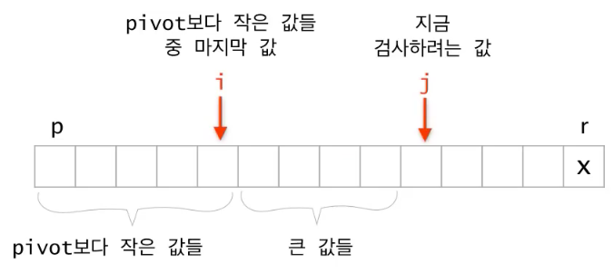
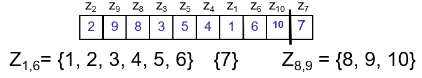
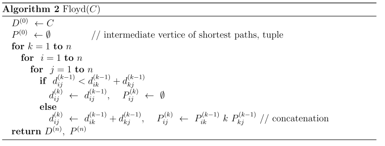

고급 프로그래밍 방법론
---
$\color{red}{\text{environment setting: 파일 > 환경설정> markdown> 인라인 수식 체크 해제}}$

**author @** 

- [x] 유성욱
- [x] 유세욱

**목차 **

[2018-2](#2018---2)

[2018-1](#2018---1)

[2016-2](#2016---2)

[2016-1](#2016---1)

[2015-2](#2015---2)

[2015-1](#2015---1)

# 2018 - 2

**A. Clique **

**(1) Definition:** 그래프에서 어떤 pair의 vertices 라도 connected 되어 있는 sub graph의 vertex set

**NP  증명: ** clique인 subgraphd에서 모든 pair의 vertices가 연결이 되어있는가 $O(N^2)$ 안에 확인 가능 (vertice 수를 $N$ 이라 하면)
**(2) Clique is Np-hard 증명 [그림 및 detail](https://opendsa-server.cs.vt.edu/ODSA/Books/Everything/html/threeSAT_to_clique.html)  **

> 일단, NP-hard 집합의 개념 이해 필요!  NP-hard 어떤 문제를 polynomal 안에 풀수 있다면(진짜 풀 수있는지는 모름), (NP-hard 안의 모든 문제들 사이에서 polynomial time 안에 변환이 가능해서)NP-hard안에 있는 모든 집합의 문제들이 전부 polynomial 안에 풀릴 수 있는 문제들의 모임. 
>
> if 3-SAT $\le_p$ Clique (3-SAT is reducible to Clique), Clique is NP-hard  (3-SAT 는 어려운 문제고, reduction algorithm 에 의해 3-SAT를 Clique로 변환가능한데, 이게 만약 polynomial 안에 풀리면, 3-SAT, Clique 모두 polynomial time안에 풀 수 있는 것임). 따라서, polynomial reduction 알고리즘과 $\Leftrightarrow$ 관계를 설명해야 함

**reduction  algorithm:** 어떤 한 3-SAT인 boolean equation $\Phi$ 가 주어졌을때, 각각의 literal 에 대해서 vertex를 만들고, 자기가 속한 clause의 literal과 다른 clause에서의 negation을 제외한 나머지 에 대해서 edge를 만든다. ($\Phi$ 안에 총 m 개의 clause가 있다면 m개의 clauter 가 생김). 이 과정은 $O(N^p)$ 걸림.

(여기서 알수있는 intuition은 각 생성된 graph의 vertex가 연결되 있다면, 그에 대응하는 literal 쌍은 동시에 True)

**3-SAT $\Rightarrow $  k-Clique:** 3-SAT가 satisfiable하면(각 clause 마다 적어도 하나의 literal이 True, 게다가 negation은 연결하지 않았음), (각기 다른 clause 에서 파생된 vertex는 반드시 연결되어 있기 때문에) clause의 수(m=k) 사이즈의 clique이 있을 수 밖에 없다. 

**k-Clique $\Rightarrow$ 3-SAT:** k-Clique가 그래프에 있다면, (k개의 cluster에서 하나씩의 vertex가 연결이 되어 있어서 그에 대응되는 clause의 literal이 모두 True가 되므로)  $\Phi$는 satisfiable하다.

**B. pseudo-code **

(1) randomized quick sort (increasing order) 



```python
QS(a, p, r)
	if p >= r
		return
	# select random btw p ~ r
	i = random(p,r)
	swap(a[i], a[r]) # 무조껀 뒤로 보냄
	
	# partition
	i = p - 1
	for j = p to r-1
		if a[j] <= a[r]
			i += 1
			swap(a[j], a[r])
    swap(a[i+1], a[r])
    q = i + 1 # a[q] finds a right position
    
    # divide and conquer
    QS(a, p, q-1)
    QS(a, q, r)	
```

**(3) expected running time $O(nlogn)$ 증명**

intuition: quick sort에서 parition 은 $O(n)$ 번 불리게 되어있다. 이때, qicksort의 성능은 pivot이 어디 선택되어 partition 내부 안에서 비교 횟수가  몇번 불리느냐에 달려있다. 모든 $n$ 번의 patition에서 비교 횟수가 불리는 수의 합을 $X$ 라 하면,  time complexity는 $O(n+X)$ 이다.  

그래서 call 되는 patition 함수들 안에서 비교되는 횟수의 합의 평균  $E[X] $가 성능을 좌우한다. 이 값을 구하기위해 그 안에서 정렬된 숫자를 $\{z_i, ...,z_j\}$ 라고 하면, 


그리고, $E[X]$를 estimate하기위해  i.i.d. $ X_{ij} = 1$ (if $z_i$  is compared to $z_j$, o.w., 0) 를 정의하면 ($P[$ $z_i$  is compared to $z_j] = P_{ij}$ 라 하자, iid 특성은 평균값이 확률값과 같음) 

$E[X] = E[\sum_{i=1}^{n-1}\sum_{j=i+1}^{n}X_{ij}] = \sum_{i=1}^{n-1}\sum_{j=i+1}^{n}E[X_{ij}] = $ $\sum_{i=1}^{n-1}\sum_{j=i+1}^{n}$$P_{ij}$ 이되는데, 



위의 그림으로 부터 알 수 있는 것은, 서로 다른 partition에 있는 $z_i$ 와 $z_j$ 는 절대 비교 안된다는 사실로부터 partition 함수 안에  $z_i$, $z_j$ 가  있어야하며 둘중 하나는 반드시 pivot이 될것 이라는 사실이다. 따라서, $j-i+1$ element 중 $z_i, z_j$가 각각 pivot으로 뽑힐 확률인 $P_{ij} = 2/(j-i+1)$  이다.

다시 되돌아가서, 계산해보면,
$\sum_{i=1}^{n-1}\sum_{j=i+1}^{n}$$2/(j-i+1)$ $\le n\sum_{i=1}^{n} \sum_{i \le j}{2/j} = O(nlogn)$

 더 나아가서 ...

r.f. 항상좋은 quick sort 방법은? median of median 이용 [link](http://1ambda.github.io/algorithm/design-and-analysis-part1-2/)

 

**(2) Dijstra's algorithm **

기본가정: 모든 edge는 non-negative

intuition: binary priority queue 를 이용하여 src 부터 target까지 shortest path distance를 찾겠다.

구현 링크 [python](https://github.com/SUNGWOOKYOO/Algorithm/blob/master/src_Python/sw_graph/SsSP_Dijkstra.ipynb) [c++](https://github.com/SUNGWOOKYOO/Algorithm/blob/master/src_Cplus/graphAlgo/Dijkstra.cpp)

```python
Dijkstra(Graph, s)
	Q = priority queue Q 
	S = empty set 
	for each vertex v in Graph             
		dist[v] ← INF # src를 제외한 모든 vertex distance INF        
		# prev[v] ← Nan                 
		add v to Q # 모든 vertex를 Q에 넣는다.                     
	dist[s] ← 0                        
     
	while Q is not empty
		u ← Q.min() # extract a node with smallest dist value
		S = S union u # shortest distance 가 결정됨
        for each neighbor v of u
			if u not in S and dist[u] + w(u,v) < dist[v]:               
				dist[v] ← dist[u] + w(u,v) 
				# prev[v] ← u 
				Q.update(v, dist[v])
				
	return dist[], prev[]
```

**C. flow network (2018_2 APM hw3 참조)**

**(1) flow network definition:** 그래프에는 src, sink node가 있고, edge가 있으면 nonnegative capacity 를 갖고, edge가 없으면 capacity가 0 이됨. 

**flow definition:** capacity $c$ , src, sink 노드 $s, t$ 를가진 flow network $G = (V,E)$ 에 대해서 edge $E$ 를 어떤 실수값 $ \R $  로 mapping 시켜주는 함수 인데, 2가지 성질을 갖는다. 

1. Capacity constraint: $ 0 \le f(u,v) < c(u,v) $  ,$\forall (u,v) \in E $

   > flow 값이 제한됨

2. Flow conservation: $\sum_{(u,v)\in E}{f(u,v)}  = \sum_{(v,w)\in E}{f(v,w)} $ ,$\forall v \in V - \{s,t\} $

   >   src, sink 를 제외한 노드 $v$에 들어온 flow 양과  나가는 flow 양이 같다. 

**(2) flow maximization problem definition: **Given a flow network G with source s and sink t , find a flow of maximum value from s to t

**LP formula: **$Maximize$ $\sum_{v\in V}{f(s,v)}$   $s.t$  Capacity Constarint, Flow conservation 

이때, capacity 는 주어진 graph의 weights $c(u, v) = w(u,v)$

< r.f. 이 문제는 residual network와 augmented path 라는 개념을 통해 ford fulkerson algorithm에 의해 풀릴 수 있다.>

---

# 2018 - 1

**A. [Hamiltonian path problem](https://en.wikipedia.org/wiki/Hamiltonian_path_problem) **

**(1) definition:** directed graph에서 모든 vertices 를 한번씩만 방문하는 path(Hamiltonian path)가 있는가 

**(2) [HAMPATH is NP](ps://www.geeksforgeeks.org/proof-hamiltonian-path-np-complete/): **어떤 graph에서 HAMPATH 가 주어지면, 그것은 서로 다른 vertex sequence인데, 각각의 연속된 정점 간의 edge 가 graph에 있는지 확인하는데 polynomial time이 걸린다.

 

**B. 2018-2 A. (3) 참고**

**C.All pair shortest path with DP: [Floyd-Warshall_algorithm](https://en.wikipedia.org/wiki/Floyd–Warshall_algorithm)  [python](https://github.com/SUNGWOOKYOO/Algorithm/blob/master/src_Python/sw_graph/ApSP_FloydWarshall.ipynb)  [c++](https://github.com/SUNGWOOKYOO/Algorithm/blob/master/src_Cplus/graphAlgo/FloydWarshall.cpp) **

기본 가정: no negative cycle 

 먼저 주어진 그래프에 대한 edge정보로 부터 matrix $C$ 정의 

$$
C_{ij} = \left \{ 
\begin{matrix}
0 & \text{if } i=j \\
c(i,j) \ge 0 & \text{if } i \ne j, (i,j) \in E  \\
\infty & \text{if } i \ne j, (i,j) \notin E \\
\end{matrix}\right.
$$

$d_{ij}^{(k)}$: $v_i  \text{~} v_j$ 까지 가는데 $v_1, .., v_k$를 거쳐가는지에 대한 유무가 update된 shortest path distance ($k$ 가 증가함에따라 점점 더 많은 노드정보를 거쳐가는것에 대한 정보를 업데이트 된다).


$$
d_{ij}^{(k)} = \left \{ 
\begin{matrix}
c(i,j) \ge 0 & \text{if } k=0 \\
min \{ d_{ij}^{(k-1)}, d_{ik}^{(k-1)} + d_{kj}^{(k-1)}   \} & \text{if } k \ge 1  \\
\end{matrix} \right.
$$

Time complexity: $O(n^3)$ because all entry $(1\le i,j,k\le n)$ ,  is $n^3$, each entry takes $O(n)$ time

backpropagation: $P^{(k)}$의 각 entry $P_{ij}^{(k)}$가 의미하는것은 현재까지 업데이트된 $v_k$ 를 지나는 $v_i \text{~}v_j$ 의 shortest path 정보를 의미한다. ($k = 1,..,n$ 까지 모두 update되어야 진짜 shortest path가 됨)



---

# 2016 - 2

**B. (2) [Edmonds-Karp algorithm](https://cp-algorithms.com/graph/edmonds_karp.html) (Ford-Fulkerson 방법의 한가지 구현 방법)**

이 알고리즘을 설명하기전에 먼저,  residual network $G_f$ 와 augmented path의 개념을 아야한다.

Definition of $G_f$: 주어진 flow network $G$ 와 동일한 정점과 간선을 갖는다. 그리고,  

residual capacity 정의는 다음과 같다.  

(주의사항, edge가 $(u,v),(v,u)$ 둘다 있을때는 $c_f(u,v)  = c(u,v) - f(u,v) + f(v,u)$ ) 
$$
c_f(u,v) = \left \{ \begin{matrix}
c(u,v) - f(u,v)  & \text{if } (u,v) \in E \\ 
f(v,u) & \text{if } (v,u) \in E \\
0 & \text{o.w } \\
\end{matrix} \right.
$$

> augmented path는 src $s$ 에서 sink $t$ 까지 모든 residual capacity가 0 이상인 simple path를 말한다.  
>
> $G_f$ 는 augmentation 연산이 superposition으로 계산될 수 있는 특성을 가진다. ($G_f$는 flow $f$에 의해 생성된 residual network 이고, $f'$ 은 $G_f$의 또 다른 flow. 따라서, flow는 포화 될때 까지 계속 augmented될 수있다.) 
>
> |$f \uparrow f $| $=  |f| + |f'|$ 
>
> augmentation 연산을 다음과 같다.
> $$
> f \uparrow f' (u,v) = \left \{ \begin{matrix}
> f(u,v) + f'(u,v) - f'(v,u) & \text{if } (u,v) \in E \\
> 0 &\text{o.w} \\
> \end{matrix}\right.
> $$

먼저, Ford-Fulkerson 방식에 대한 pseudo code 

Time complexity: $O(|E|f^*)$ , $f^*$ 은 flow를 업데이트 한 총 횟수 (운이 나쁘면 매우 오래걸릴 수 있다.)


이제, 본론으로 돌아와서 [Edmonds-Karp algorithm]([https://en.wikipedia.org/wiki/Edmonds%E2%80%93Karp_algorithm](https://en.wikipedia.org/wiki/Edmonds–Karp_algorithm))의 기본 idea는 다음과 같다. 

$G_f$ 에서 $s \rightarrow t$ 로 가는 path를 찾을 때, 모든 edge들의 weight를 1로 한(unit distance로 본) [BFS 알고리즘](https://gmlwjd9405.github.io/2018/08/15/algorithm-bfs.html) 을 이용함. [DFS, BFS c++](https://github.com/SUNGWOOKYOO/Algorithm/blob/master/src_Cplus/graphAlgo/DFS_BFS.cpp)

> 이때 주목해야 할 intuition은 각 iteration 마다 찾아진 augmented path 중에 적어도 한개의 edge는 saturated($c_f(e) = 0$) 되며 (왜냐하면 flow가 update 될때, $G_f$ 의 residual capacity값이 바뀌게 되는데 그에 따라 BFS 하는 방향 이 계속 바뀜 ), 점점 augmented path의 길이는 길어진다. 이때, 증가되는 augmented path의 최대 길이는 |$V$|$-1$이기 때문에 모든 iteration에서 flow가 증가한 수$ f^* $는 $O(|V||E|)$ 로 bounded 된다. 

**pseudo code [ref](https://brilliant.org/wiki/edmonds-karp-algorithm/#algorithm-pseudo-code)**

Edmonds($G, s, t$)

​		$G_f \leftarrow G$ 

​		for each edge $(u,v)$ in $G.E$

​				$(u,v).f$ = 0

​		# iteration

​		while $\exist ~ p$ from $s$ to $t$ using $BFS(G_f)$

​				$c_f(p) = min \{ c_f(u, v): (u,v) ~ in ~ p\}$

​				# aumentations

​				for each edge $(u,v)$ in $p$

​						if $(u,v) \in G.E$

​								$(u.v).f  = (u,v).f + c_f(p)$

​						else 

​								$(u.v).f  = (u,v).f - c_f(p)$


time complexity: $O(|V||E|^2 )$ 왜냐하면, BFS 하는데 $O( |E|)$,  총 flow augmented 수 $O(|V||E|)$

---

# 2016 - 1 

**A.** 

*Definition of P*

 질문자체에 대해서 예 혹은 아니오로 다항식 시간안에 답할 수 있는 문제

*Definition of NP* 

 예라는 근거가 주어졌을 때 그것이 Yes임을 다항식 시간안에 확인 할 수 있는 문제 

*Definition of NP-Complete*

 Np 이고 Np hard 를 만족하는 문제

 Np hard는 모든 Np 문제에 대해서 다항식 시간 변환이 가능한 문제 이다.

 다항식 시간 변환은 변환이 다항식 시간안에 이루어지고 두 사례의 답이 일치하는 문제이다.

*SAT problem*

 논리곱 정규형(CNF(Nonjunctive Normal Form))의 부울 식이 주어졌을 때 그 식을 만족하는 변수를 찾는 문제

*Cook-Levin Therom* 

 SAT 문제는 NP complete이다.  

 

**B.**

**(1)**

*Procedure of deterministic quick sort algorithm*


DeterministicQuicksort(A,p,r)

​	q = Partition(A,p,r)

​	DeterministicQuicksort(A,p,q-1)

​	DeterministicQuicksort(A,q+1,r)


Partition(A,p,r)

​	i = p - 1

​	for j = p $\to$ r - 1

​		if A[j] < A[r]

​			A[++i] $\leftrightarrow$ A[j]

​	A[i+1] $\leftrightarrow$ A[r]

​	return i+1


*Running time*

i 번째 원소에서 분할이 될 때 점화식은 다음과 같다.

$T(n) = T(i-1) + T(n-i) + O(n)$ 

최악의 경우 $i = 1 \,or \,n$ 이고 다음과 같다.

$T(n) = T(n-1) + O(n)$

반복대치를 통해 시간복잡도를 구해보자
$$
\cancel{T(0)} = 0\\
\cancel{T(1)} = \cancel{T(0)} + O(1)\\
\cancel{T(2)} = \cancel{T(1)} + O(2)\\
...\\
T(n) = \cancel{T(n-1)} + O(n)\\
-------------\\
T(n) = O(1)\, + \,...\, + \,O(n) = O(n^2)
$$

**(2)**

*Procedure of randomized quick sort algorithm*

 RandomizedQuicksort(A,p,r)

​	q = RandomizedPartition(A,p,r)

​	RandomizedQuicksort(A,p,q-1)

​	RandomizedQuicksort(A,q+1,r)


 RandomizedPartition(A,p,r)

​	x = random(p,r)

​	A[x] $\leftrightarrow$ A[r]

​	Partition(A,p,r)


*Running time*

추정후 증명 방법을 통해 시간복잡도를 구해보자
$$
Suppose \;\exist c \;s.t\; T(k) \le ck\log{k} \;\forall \;2\le k <n
$$
$T(n) = T(i-1) + T(n-i) + O(n)$ 에서 i는 1 부터 n 중에서 uniform하게 선택되기 때문에
$$
\begin{matrix}
T(n) &=& \frac{1}{n}\sum_{i=1}^n {T(i-1) + T(n-i)} + O(n)\\
&=& \frac{2}{n}\sum_{k=0}^{n-1}T(k) + O(n)\\
&=& \frac{2}{n}\sum_{k=2}^{n-1}T(k) + \{O(0) + O(1) + O(n)\}\\
&\le& \frac{2}{n}\sum_{k=2}^{n-1}ck\log{k} + O(n)\leftarrow 가정\\ 
&\le& \frac{2}{n}\sum_{k=1}^{n-1}ck\log{k} + O(n)\\
&=& \frac{2c}{n}\{\sum_{k=1}^{[\frac{n}{2}]-1}k\log{k} + \sum_{k=[\frac{n}{2}]}^{n-1}k\log{k}\} + O(n)\\
&\le& \frac{2c}{n}\{\sum_{k=1}^{[\frac{n}{2}]-1}k\log{\frac{n}{2}} + \sum_{k=[\frac{n}{2}]}^{n-1}k\log{n}\} + O(n)\leftarrow \sum_{k=1}^{[\frac{n}{2}]-1}\log{k} \le \log{\frac{n}{2}}이므로\\
&=& \frac{2c}{n}\{\sum_{k=1}^{[\frac{n}{2}]-1}k(\log{n} - 1) + \sum_{k=[\frac{n}{2}]}^{n-1}k\log{n}\} + O(n)\\
&=& \frac{2c}{n}\{\log{n}\sum_{k=1}^{n-1}k - \sum_{k=1}^{[\frac{n}{2}]-1}k\} + O(n)\\
&\le& \frac{2c}{n}\{\log{n}\frac{n(n-1)}{2} - \frac{1}{2}(\frac{n}{2}- 1)(\frac{n}{2})\} + O(n) \leftarrow [\frac{n}{2}] \le \frac{n}{2} 이므로 \\
&=& c(n\log{n} -\log{n} - \frac{n}{8} + \frac{n}{4}) + O(n)\\
&=& O(n\log{n})
\end{matrix}
$$

**C.**

**(1)**

*Minimum spanning tree problem*

​	간선들이 가중치를 갖는 그래프에서 가중치의 합이 최소가 되는 tree를 찾는 문제 

*Pseudo code of the Prim's algorithm*

​	Prim(G, r)

​		Q = G.V

​		for each u $\in$ Q

​			d[u] = $\infin$

​		d[r] = 0

​		while (Q = $\empty$)

​			u = deletemin(Q, d)

​			for each v $\in$ G.adj(u)

​				if v $\in$ Q and d[v] $\le$ G.w(u,v)

​					d[v] = G.w(u,v)

​					tree[v] = u

​	deletemin(Q,d)

​		queue에서 d가 가장 작은 vertex를 pop					

**(2)**

*Vertex cover problem for an undirectred graph*

​	그래프에서 모든 간선의 양 끝점을 포함하는 정점들의 집합들 중 최소의 집합(optimal vertex cover)을 찾는 것

*2 Approximation polynomial time algorithm*

​	ApproximatedVertexcover(G)

​		C = $\empty$ 

​		E` = G.E

​		while (E` $\ne$ $\empty$)

​			for each (u,v) $\in$ E`

​				C = C $\cup$ {(u,v)}

​				Deleteedge(E`,u,v) 


​	Deleteedge(E, u, v)

​		u,v 와 연결된 간선들을 모두 제거

​	

​	*2 approximation 증명*

​	A를 C의 subset이라고 하자.

​	optimal vertex cover를 C*이라고 하자.

​	A에 있는 정점들을 cover하기 위해서 

​	C*은 C의 모든 간선에서 적어도 하나의 끝점을 포함한다.

​	A에 있는 어떤 두개의 간선도 양 끝점을 공유하지 않기 때문에

​	C\*도 A에 있는 두 간선을 공유하지 않아서 

​	$|C*| \ge |A|$ 가 성립한다.

​	A는  C 집합의 간선에서 양끝점 중 하나를 고르는 것이기 때문에

​	$|C| = 2|A| \le 2|C*|$  을 만족한다.	 

 	

​	*Running time*

​	graph가 adjacent list로 구현되어 있다면 각 정점별로 연결된 간선들을 탐색해야하므로

​	O(V+E)가 소요된다. 	

**(3)**

*Definition of the flow network*

​	모든 간선들이 음이아닌 용량의 가중치를 갖는 방향그래프이다.
$$
(u,v) \notin E \Rightarrow c(u,v) = 0\\
\exists u,v \;s.t\; u\neq v \Rightarrow \exists s, t
$$
*Flow maximization problem*
$$
Maximize\sum_{v\in V} f(u,v)\\
subject \; to \; 0 \le f(u,v) \le c(u,v) \; \forall (u,v) \in E\\
and \sum_{v \in V}f(u,v) = \sum_{v \in V}f(v,u) \; \forall u \in V - \{s,t\}
$$

---

# 2015 - 2 

---

**1.**

*Three examples of NP-complete problem*

Hamiltonian path problem

​	무향그래프가 주어졌을 때 모든 정점을 한번씩만 방문하는 경로의 존재 여부를 찾는 문제

SAT problem

​	논리곱 정규형(CNF(Nonjunctive Normal Form))의 부울 식이 주어졌을 때 그 식을 만족하는 변수의 존재 여부를 찾는 문제

Vertex cover problem

​	무향 그래프에서 모든 간선의 양 끝점을 포함하는 정점들의 집합들 중 최소의 집합(optimal vertex cover)을 찾는 것

**2.**

*Describe the linked list representation of a graph*

각 정점에 인접한 정점들을 2차원 배열의 자료구조로 표현하는 방법이다.

정점의 개수가 n개인 그래프가 주어졌을 때 n$\times$ n matrix를 준비한다.

가중치가 없는 그래프라면 가중치의 값을 항상 1로 할당한다.

정점 i에서 정점 j로 가는 간선이 존재하면 그 가중치의 값을 원소의 값으로 할당한다.

간선이 존재하지 않으면 값을 0으로 할당한다.

* Advantage
  * 간선의 존재여부를 확인하는데 상수 시간 (O(1))이 소요된다. 
* Disadvantage
  * 그래프를 생성하는데 $n^2$ 의 메모리와 O($n^2$) 의 시간이 소요된다.

*Describe the adjacency matrix representation of a graph*

각 정점에 인접한 정점들을 리스트로 표현하는 방법이다.

정점의 개수가 n개인 그래프에서 n 길이의 list를 준비한다.

각 정점에 인접한 정점들을 연결리스트로 매단다.

각 노드는 정점번호, 가중치, 다음 정점의 포인터 로 구성된다.

필요한 총 노드 수는 총 간선수의 두배이다.

* Advantage
  * 그래프를 생성하는데 2|E|만큼의 메모리가 소요되므로 간선 수가 적은 경우 유용하다.
  * 
* Disadvantage
  * 간선 수가 많은 경우 (|E| > |V|) 오히려 필요한 오버헤드가 크다.
  * 간선의 존재여부를 확인 하는데 O(n) 시간이 소요된다. 

**3.**

*Mergesort algorithm*

​	Mergesort(A, p, r)

​		q = $[\frac{p + r}{2}]$ 

​		Mergesort(A, p, q)

​		Mergesort(A, q+1, r)

​		Merge(A, p, q, r)

​	Merge(A, p, q, r)

​		i = p 										$\leftarrow$ 왼쪽의 비교 index

​		j = q + 1							      $\leftarrow$ 오른쪽의 비교 index

​		t = 1										$\leftarrow$ 복사를 위한 index

​		while ( i $\le$ q and j $\le$ r) 		$\leftarrow$ 둘중 하나가 빌 때까지

​			 if A[i] $\le$ A[j]

​				tmp[t++] = A[i++]

​			 else

​				tmp[t++] = A[j++]

​		 while (i $\le$ q)						  $\leftarrow$ 왼쪽만 남은 경우

​				tmp[t++] = A[i++]

​		 while(j $\le$ r)							$\leftarrow$ 오른쪽만 남은 경우

​				tmp[t++] = A[j++]

​		  i = p

​		  t = 1

​		  while( i $\le$ r)						 $\leftarrow$ 결과를 A에 저장

​				A[i++] = tmp[t++] 					 	 


*Runnning time*

마스터정리를 사용하여 시간복잡도를 구해보자.
$$
T(n) = 2 \times T(\frac{n}{2}) + O(n)\\
f(n) = O(n)\\
h(n) = n^{\log_{2}{2}} = O(n) = f(n)\\
\therefore T(n) = O(n\log{n})
$$


**4.**

*1.Pseudo-code for a dynamic programming algorithm for the largest common subsequence problem*

*Largest common subsequence problem*

 두 문자열에 공통으로 나타나는 부분 순서 중 가장 긴 것

​	optimal substructure
$$
\mbox{Let C_{i,j}} \mbox{ be the length of LCS of } 
X_i = <x_1, ..., x_i> \and Y_j = <y_1, ..., y_j>\\
C_{i,j} = 
\begin{cases}
0, &\mbox{if } i = 0 \or j = 0 \\
C_{i-1,j-1} + 1 &\mbox{if } i,j > 0 \and x_i = y_j \\
\max\{C_{i-1,j}, C_{i, j-1}\} &\mbox{if } i,j > 0 \and x_i \neq y_j
\end{cases}
$$


​	pseudo-code for Recursive call

​		LCS(m,n)

​			if m= 0 or n =0

​				return 0

​			else if $x_m = y_m$ 

​				return LCS(m-1, n-1) + 1

​			else if $x_m \neq y_m$	

​				return max{LCS(m-1, n), LCS(m, n -1)

​	pseudo-code for dynamic programming (bottom-up)

​			LCS(m,n)

​			\# initialization

​			for i = 0 to m

​				C[i, 0] = 0

​			for j =0 to n

​				C[0, j] =0

​			문제의 크기만큼 반복

​			for i = 1 to m

​				for j = 1 to n

​					if $x_i = y_j$

​						C[i, j] = C[i -1, j -1] + 1

​					else $x_i \neq y_j$

​						C[i, j] = max{C[i - 1, j], C[i, j -1]}

​			return C[m,n]

​	Running time

​		O(mn)


*4.Pagerank formula of the Google's pagerank algorithm*

​	[페이지랭크 알고리즘 참조](https://sungmooncho.com/2012/08/26/pagerank/)  
$$
\mbox{Let A be a web page and}\\
PR(.) \mbox{ be the rank of a page}\\
\{T_1 , ...T_n\} \mbox{ be the page that points A and}\\
C(.) \mbox{ be the number of links that the page has}\\
N \mbox{ be the number of total pages}\\
d \mbox{ be the probability that a person choose other pages}\\
PR(A) = \frac{1-d}{N} + d\{\frac{PR(T_1)}{C(T_1) }+ ... + \frac{PR(T_n)}{C(T_n)}\}
$$

------


# 2015 - 1

---

