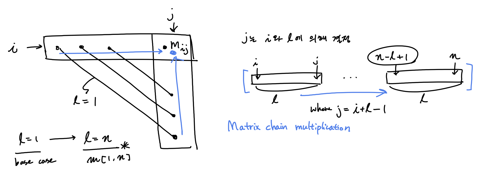
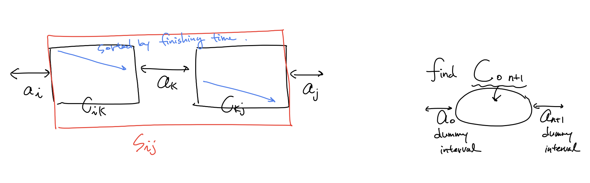
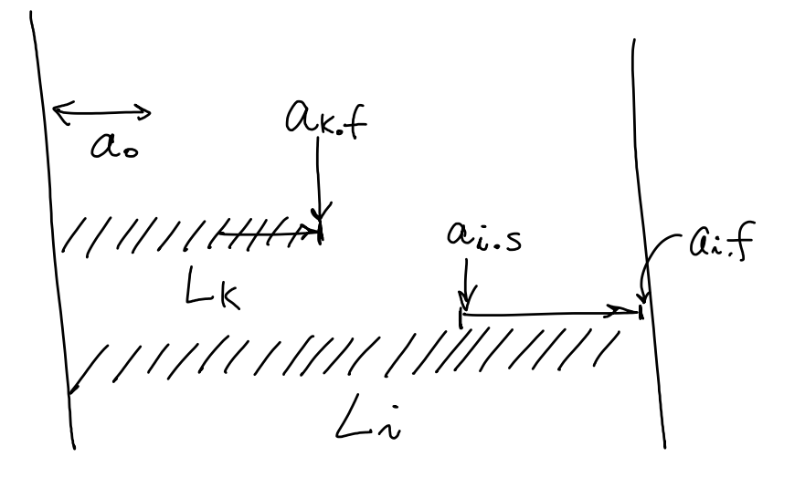

# Programming Methodology 

## Contents

[Sort](#Sort)

[Dynamic Programming](#Dynamic-Programming)

[Greedy](#Greedy)

[Graph](#Graph)

## Sort 

[c++ ](https://github.com/SUNGWOOKYOO/Algorithm/blob/master/src_Cplus/Sort.cpp)  [python](https://github.com/SUNGWOOKYOO/Algorithm/blob/master/src_Python/sw_sort.ipynb)

### Quicksort (increasing order) 


```python
QS(a, p, r)
	if p >= r
		return
	# select random btw p ~ r
	i = random(p,r)
	swap(a[i], a[r]) # 무조껀 뒤로 보냄
	
	# partition
	i = p - 1
	for j = p to r-1
		if a[j] <= a[r]
			i += 1
			swap(a[j], a[r])
    swap(a[i+1], a[r])
    q = i + 1 # a[q] finds a right position
    
    # divide and conquer
    QS(a, p, q-1)
    QS(a, q, r)	
```

randomized quick sort가 아닐 경우 **worst case time complexity** 

i 번째 원소에서 분할이 될 때 점화식은 다음과 같다.

$T(n) = T(i-1) + T(n-i) + O(n)$ 

최악의 경우 $i = 1 \,or \,n$ 이고 다음과 같다.

$T(n) = T(n-1) + O(n)$

반복대치를 통해 시간복잡도를 구해보자
$$
\cancel{T(0)} = 0\\
\cancel{T(1)} = \cancel{T(0)} + O(1)\\
\cancel{T(2)} = \cancel{T(1)} + O(2)\\
...\\
T(n) = \cancel{T(n-1)} + O(n)\\
-------------\\
T(n) = O(1)\, + \,...\, + \,O(n) = O(n^2)
$$


proof by mathmatical induction 방법을 통해 randomized quicksort 의 expected time complextiy 증명 
$$
Suppose \;\exist c \;s.t\; T(k) \le ck\log{k} \;\forall \;2\le k <n
$$
$T(n) = T(i-1) + T(n-i) + O(n)$ 에서 i는 1 부터 n 중에서 uniform하게 선택되기 때문에
$$
\begin{matrix}
T(n) &=& \frac{1}{n}\sum_{i=1}^n {T(i-1) + T(n-i)} + O(n)\\
&=& \frac{2}{n}\sum_{k=0}^{n-1}T(k) + O(n)\\
&=& \frac{2}{n}\sum_{k=2}^{n-1}T(k) + \{O(0) + O(1) + O(n)\}\\
&\le& \frac{2}{n}\sum_{k=2}^{n-1}ck\log{k} + O(n)\leftarrow 가정\\ 
&\le& \frac{2}{n}\sum_{k=1}^{n-1}ck\log{k} + O(n)\\
&=& \frac{2c}{n}\{\sum_{k=1}^{[\frac{n}{2}]-1}k\log{k} + \sum_{k=[\frac{n}{2}]}^{n-1}k\log{k}\} + O(n)\\
&\le& \frac{2c}{n}\{\sum_{k=1}^{[\frac{n}{2}]-1}k\log{\frac{n}{2}} + \sum_{k=[\frac{n}{2}]}^{n-1}k\log{n}\} + O(n)\leftarrow \sum_{k=1}^{[\frac{n}{2}]-1}\log{k} \le \log{\frac{n}{2}}이므로\\
&=& \frac{2c}{n}\{\sum_{k=1}^{[\frac{n}{2}]-1}k(\log{n} - 1) + \sum_{k=[\frac{n}{2}]}^{n-1}k\log{n}\} + O(n)\\
&=& \frac{2c}{n}\{\log{n}\sum_{k=1}^{n-1}k - \sum_{k=1}^{[\frac{n}{2}]-1}k\} + O(n)\\
&\le& \frac{2c}{n}\{\log{n}\frac{n(n-1)}{2} - \frac{1}{2}(\frac{n}{2}- 1)(\frac{n}{2})\} + O(n) \leftarrow [\frac{n}{2}] \le \frac{n}{2} 이므로 \\
&=& c(n\log{n} -\log{n} - \frac{n}{8} + \frac{n}{4}) + O(n)\\
&=& O(n\log{n})
\end{matrix}
$$


다른방식으로 **expected running time $O(nlogn)$ 증명**

intuition: quick sort에서 parition 은 $O(n)$ 번 불리게 되어있다. 이때, qicksort의 성능은 pivot이 어디 선택되어 partition 내부 안에서 비교 횟수가  몇번 불리느냐에 달려있다. 모든 $n$ 번의 patition에서 비교 횟수가 불리는 수의 합을 $X$ 라 하면,  time complexity는 $O(n+X)$ 이다.  

그래서 call 되는 patition 함수들 안에서 비교되는 횟수의 합의 평균  $E[X] $가 성능을 좌우한다. 이 값을 구하기위해 그 안에서 정렬된 숫자를 $\{z_i, ...,z_j\}$ 라고 하면, 


그리고, $E[X]$를 estimate하기위해  i.i.d. $ X_{ij} = 1$ (if $z_i$  is compared to $z_j$, o.w., 0) 를 정의하면 ($P[$ $z_i$  is compared to $z_j] = P_{ij}$ 라 하자, iid 특성은 평균값이 확률값과 같음) 

$E[X] = E[\sum_{i=1}^{n-1}\sum_{j=i+1}^{n}X_{ij}] = \sum_{i=1}^{n-1}\sum_{j=i+1}^{n}E[X_{ij}] = $ $\sum_{i=1}^{n-1}\sum_{j=i+1}^{n}$$P_{ij}$ 이되는데, 


위의 그림으로 부터 알 수 있는 것은, 서로 다른 partition에 있는 $z_i$ 와 $z_j$ 는 절대 비교 안된다는 사실로부터 partition 함수 안에  $z_i$, $z_j$ 가  있어야하며 둘중 하나는 반드시 pivot이 될것 이라는 사실이다. 따라서, $j-i+1$ element 중 $z_i, z_j$가 각각 pivot으로 뽑힐 확률인 $P_{ij} = 2/(j-i+1)$  이다.

다시 되돌아가서, 계산해보면,
$\sum_{i=1}^{n-1}\sum_{j=i+1}^{n}$$2/(j-i+1)$ $\le n\sum_{i=1}^{n} \sum_{i \le j}{2/j} = O(nlogn)$

 더 나아가서 ...

r.f. 항상좋은 quick sort 방법은? median of median 이용 [link](http://1ambda.github.io/algorithm/design-and-analysis-part1-2/)

[quickselect c++](https://github.com/SUNGWOOKYOO/Algorithm/blob/master/src_Cplus/QuickSelect.cpp)


### Mergesort

```python
Merge(A, p, q, r)
    n1 = q - p + 1
    n2 = r - q
    let L[1 .. n1 + 1] and R[1 ..n2 + 1] be new arrays
    for i = 0 to n1
        L[i] = A[p + i]
    for j = 0 to n2
        R[j] = A[q + j + 1]
    L[n1 + 1] = Inf
    R[n2 + 1] = Inf
    i,j = 0
    for k = p to r
        if L[i] <= R[j]
            A[k] = L[i]
            i += 1
        else
            A[k] = R[j]
            j += 1

MS(A, p, r)
    if p >= r 
        return
    q = (p + r) / 2;
    MS(A, p, q);
    MS(A, q + 1, r);
    MS(A, p, q, r);
```

**time complexity**

마스터정리를 사용하여 시간복잡도를 구해보자.
$$
T(n) = 2 \times T(\frac{n}{2}) + O(n)\\
f(n) = O(n)\\
h(n) = n^{\log_{2}{2}} = O(n) = f(n)\\
\therefore T(n) = O(n\log{n})
$$


### Heapsort

```python
heapify(A, i) 
    left = 2i
    right = 2i + 1
    
    if left > n - 1 
    	return
    
    # find largest among A[i], A[left], A[right]
    if A[i] < A[left]
    	largest = left
    else 
    	largest = i 
    if A[largest] < A[right]
    	largest = right
    
    swap(A[i], A[largest])
    
    if largest != i
    	heapify(A, largest)

# bottom up 
build_heap(A)	
	A.heapsize = |A|
    for i = A.length / 2 downto 1 
    	heapify(i)
        
# divide and conquer
make_heap(A, i)
    left = 2i
    right = 2i + 1
    
    if left > n - 1
    	return 
    
    make_heap(left)
    make_heap(right)
    
    if A[i] < A[left]
    	largest = left 
    else largest = i
    if A[largest] < A[right]
    	largest = right
    
    swap(A[i], A[largest])
    
    if largest != i 
    	heapify(A, largest)
        
HS(A)
	build_heap(A)
	for i = |A| downto 2 
    	swap(A[1], A[i])
        A.heapsize -= 1
        heapify(A,i)
```

heapify: $T(n) = T(n/2) + 1 = O(logn)$  

build_heap: $T(n) = 2T(n/2) + O(logn)$
$$
n^{log_2^2} > logn \\ 
\therefore T(n) = O(n)
$$
[divide conquer 를 통한 build heap c++](https://github.com/SUNGWOOKYOO/Algorithm/blob/master/src_Cplus/QuickSelect.cpp)


## Dynamic Programming

divide and conquer(recursive call, top down) 에서 memo를 하면 DP 가 된다. 

따라서 크게 top down with memo, bottom up 2가지 접근법

DP를 사용하려면 Optimal substructure, Overlapping subproblem 2가지 성질을 증명해야함

[python](https://github.com/SUNGWOOKYOO/Algorithm/blob/master/src_Python/sw_DPandGreedy.ipynb)

### Rod cutting 

막대 길이에 대한 가격  $p[1..n]$ 이 주어졌을때, 최대한 비싸게 막대를 잘라서 팔아먹는 가격 $r_n$ 

cut을 한 경우과 안할 경우로 나누어 더 좋은것 선택 하면 다음과 같은 식으로 reculsive formula 가능
$r_n = \max(p_n, \underset{1 \le i < n}{\max}{(r_i + r_{n-i})}) \text{, if } n \ge 1$, 

$i=n$을 포함 시키면 $p_n +r_0$이 cut을 한 경우이므로, cut에 대한 경계를 나눌 필요 없어지기 때문에 수식 간략화가 가능하다. 
$$
\begin{aligned} 
r_n &= 
\begin{cases}
 \underset{1 \le i \le n}{\max}(p_i + r_{n-i}) & \text{if } n \ge 1 \\
 0 & \text{if } n = 0\\
\end{cases}
\end{aligned}
$$

```python
# topdown with memo
lookup(p, n, r)
	# 저장되어 있다면 저장된 값 return 
	if r[n] >= 0 
    	return r[n]
    # base case 
	if n == 0
    	return 0
    q = -INF
    for i = 1 to n 
    	q = max(q, p[i] + lookup(p, n-i, r))
    # memo
    r[n] = q
    return q 

rodcut(p, n)
	let r[0..n] be a new array 
    # initialization
    for i = 0 to n 
    	r[i] = -INF
    return lookup(p, n, r)

# bottom up 
rodcut(p, n)
	let r[0..n] be a new array 
    r[0] = 0
    for j = 1 to n 
    	q = -INF
        # lookup with memo 
        for i = 1 to j
        	q = max(q, p[i] + r[j-i])
        r[j] = q 
    return r[n]
```

entry 갯수 $n$, 각 entry 계산하는데 $O(n)$ 걸린다. 따라서, $T(n) = O(n^2)$

[c++](https://github.com/SUNGWOOKYOO/Algorithm/blob/master/src_Cplus/Rodcut.cpp)


### Matrix-chain multiplication

matrix multiplication 할때, 계산을 효율적으로 하기위해 parenthesization 을 어떻게 효율적으로 할 것인가?  $m[i, j]$ 는 matrix chain multiplication $A_i A_{i+1} ..A_j $을 계산하는데 필요한 cost

$A_i \in \mathbb{R}^{p_{i-1} \times p_i}$
$$
m[i,j] =
\begin{cases}
0 & \text{if }i=j \\
\underset{i \le k <j}{\min}{(m[i,k] + m[k+1,j] + p_{i-1}p_kp_j)} & \text{if } i<j\\
\end{cases}
$$
$( A_i A_{i+1} ..A_k )$$( A_{k+1} A_{k+2} ..A_j )$ 에 대한 cost  $m[i,k] + m[k+1,j] + p_{i-1}p_kp_j$

```python
# topdown with memo
lookup(p, m, i, j)
	# 저장되어있다면 저장된 값 사용
	if m[i,j] < INF
    	return m[i,j]
    # base case
    if i == j
    	return 0
    
    q = INF
	for k= i to j-1
    	q = min(q, lookup(p, m, i, k) + lookup(p, m, k+1, j) + p[i-1]*p[k]*p[j])
    m[i,j] = q
    return q 

MatrixChain(p, n)
	let m[1..n, 1..n] be a new n × n array 
    all m[:,:] be initialized by INF
    return lookup(p, m, 1, n)

# bottom up 
MatrixChain(p) # p = [p[0], ..., p[n]]
	n = |p|-1
    # base case (chain length l = 1 일때)
    for i = 1 to n 
        m[i,i] = 0
    for l = 2 to n 
    	for i = 1 to n-l+1
        	j = i+l-1
            m[i,j] = INF
            for k = i to j-1
            	q = min(q, m[i, k] + m[k+1, j] + p[i-1]*p[k]*p[j])
            m[i,j] = q
    return m[1,n]
```

bottom up 방식이 좀 어려울수 있다. 

chain length $l = 1, ..., n$ 까지 minimum cost를 업데이트 하면 optimal cost를 찾을 수 있다. 

 

$T(n) = O(n^3)$

[c++](https://github.com/SUNGWOOKYOO/Algorithm/blob/master/src_Cplus/MatrixChain.cpp)


### Longest Common Subsequence

$C_{i,j}$ 는 $X_i$ 와 $Y_j$의 LCS 길이
$X_i = <x_1, ..., x_i>, Y_j = <y_1, ..., y_j>$
$$
C_{i,j} = 
\begin{cases}
0, &\mbox{if } i = 0 \or j = 0 \\
C_{i-1,j-1} + 1 &\mbox{if } i,j > 0 \and x_i = y_j \\
\max\{C_{i-1,j}, C_{i, j-1}\} &\mbox{if } i,j > 0 \and x_i \neq y_j
\end{cases}
$$

```python
# topdown with memo
lookup(X, Y, c, i, j)
	if c[i,j] >= 0
    	return c[i,j]
    # base case
    if i==0 or j==0
    	c[i,j] = 0
    	return c[i,j]
    
    # i > 0 or j > 0
    if X[i-1] == Y[j-1]
    	c[i,j] = lookup(X, Y, c, i-1, j-1) + 1
        return c[i,j]
    else
    	c[i,j] = max(lookup(X, Y, c, i-1, j), lookup(X, Y, c, i, j-1))
        return c[i,j]
    
LCS(X, Y, c, m, n)
	m = |X|
	n = |Y|
	let c[0..m, 0..n] be a new array 
    # initialization
    all c[:,:] be initialized by -INF
    return lookup(X, Y, c, m, n)
    
    
    
# bottom up 
LCS(X, Y)
	m = |X|
    n = |Y|
    let c[0..m, 0..n] be a new array 
    # base case
    if i == 0 to m
    	c[i,0] = 0
    if j == 0 to m
    	c[0,j] = 0
    for i = 1 to m 
    	for j = 1 to n 
        	if X[i] == Y[j]
            	c[i,j] = c[i-1, j-1] + 1
            else 
            	c[i,j] = max(c[i-1, j], c[i, j-1])
    return c[m,n]
```

$T(n) = O(mn)$

[c++](https://github.com/SUNGWOOKYOO/Algorithm/blob/master/src_Cplus/LCS.cpp)


### Assembly Line 

pdf 참조 

[c++](https://github.com/SUNGWOOKYOO/Algorithm/blob/master/src_Cplus/AssemblyLine.cpp)


### Floyd Warshall Algorithm
All pair shortest path with DP

기본 가정: no negative cycle 

 먼저 주어진 그래프에 대한 edge정보로 부터 matrix $C$ 정의 
$$
C_{ij} = \left \{ 
\begin{matrix}
0 & \text{if } i=j \\
c(i,j) \ge 0 & \text{if } i \ne j, (i,j) \in E  \\
\infty & \text{if } i \ne j, (i,j) \notin E \\
\end{matrix}\right.
$$
$d_{ij}^{(k)}$: $v_i  \text{~} v_j$ 까지 가는데 $v_1, .., v_k$를 거쳐가는지에 대한 유무가 update된 shortest path distance ($k$ 가 증가함에따라 점점 더 많은 노드정보를 거쳐가는것에 대한 정보를 업데이트 된다).


$$
d_{ij}^{(k)} = \left \{ 
\begin{matrix}
c(i,j) \ge 0 & \text{if } k=0 \\
min \{ d_{ij}^{(k-1)}, d_{ik}^{(k-1)} + d_{kj}^{(k-1)}   \} & \text{if } k \ge 1  \\
\end{matrix} \right.
$$
Time complexity: $O(n^3)$ because all entry $(1\le i,j,k\le n)$ ,  is $n^3$, each entry takes $O(n)$ time

backpropagation: $P^{(k)}$의 각 entry $P_{ij}^{(k)}$가 의미하는것은 현재까지 업데이트된 $v_k$ 를 지나는 $v_i \text{~}v_j$ 의 shortest path 정보를 의미한다. ($k = 1,..,n$ 까지 모두 update되어야 진짜 shortest path가 됨)


[python](https://github.com/SUNGWOOKYOO/Algorithm/blob/master/src_Python/sw_graph/ApSP_FloydWarshall.ipynb)  [c++](https://github.com/SUNGWOOKYOO/Algorithm/blob/master/src_Cplus/graphAlgo/FloydWarshall.cpp) 


###  0 - 1 knapsack

0-1 Knapsack problem is not satisfied with Greedy choice property

$i$ 는 item index, $w$ 는 possible weight, $v_i$는 item $i$ 의 가격 

$c[i,w]$ 는 item $i$개를 주머니에 넣고, 주머니에 담을수 있는 weight가  $w$ 일때의 주머니 안의 물건들 가격   
$$
c[i,w] = 
\begin{cases}
0 &\text{if }i=0 ~ \or w=0  \\
c[i-1,w] &\text{if } w_i > w \\
max(v_i + c[i-1,w-w_i], c[i-1,w]) &\text{if } i > 0 ~ \and w \ge w_i
\end{cases}
$$

```python
# topdown with memo
# V[i], W[i]는 item i에 대한 pric와 weight 정보 array
# W(array)와 w(scalar)는 다르다.
lookup(V, W, c, i, w)
	if c[i,w] >= 0
    	return c[i,w]
    # base case
    if i==0 || w==0
    	c[i,w] = 0
        return 0
    if W[i] > w 
    	c[i,w] = lookup(V, W, c, i-1, w)
        return c[i,w]
    else
    	c[i,w] = max(V[i] + c[i-1, w-W[i]], c[i-1, w])
		return c[i,w]

knapsack(V, W, n, maxW)
	let c[0..n, 0..maxW] be a new array 
    return lookup(V, W, c, n, maxW)
        
# bottom up
knapsack(V, W, n, maxW)
	let c[0..n, 0..maxW] be a new array 
    # base case
    for i = 0 to n
    	for w to maxW
        	if i==0 || w==0
            	c[i,w] = 0
            else
				if W[i] > w
                	c[i,w] = c[i-1, w]
                else
                	c[i,w] = c[i-1, w]
    return c[n, maxW]
```

$T(n) = O(nW_{max})$

[c++](https://github.com/SUNGWOOKYOO/Algorithm/blob/master/src_Cplus/Knapsack.cpp)


## Greedy

[python](https://github.com/SUNGWOOKYOO/Algorithm/blob/master/src_Python/sw_DPandGreedy.ipynb)

### Activity Selection Problem 

여러 starting time, finish time 을가진 activity $a = [s,f]$들이 있을 때 주어진 시간내에 compatible 한 activity들을 가장 많이 포함시킬 수 있도록 scheduling 하는 문제

naive 하게 생각 해보면 $n$개의 activity들 이 있을때 $2^n$ 가지의 모든 subset 에서 각 subset 마다 가지고있는 activity들이 서로 compatible한지 검사하고, 모든 activity들이 compatible하다면 그 갯수를 저장하고, 그 중 최대를 갖는 subset를 찾는다. 

$S_k|_{k=[1,2^n]} = \{ \text{최대 n 개의 activity} \}$ 

이때, $\{ .. \}$안의 각 activity들이 서로 compatible 한가 test (All pair로 검사한다면, $O(n^2)$걸림 )

따라서, $O(2^n n^2)$ 이므로 너무 비싸다. 

조금 나아가 생각해보면, activity 들이 만약 finishing time에 의해 sorting 되어 있다고 가정해보자. 

그러면 compatible test 에서 linear하게 scan하면 된다. ($i$번째에서 starting time이 $i-1$번째의 finishing  time보다 앞선 다면 compatible하지 않은 것이므로 즉, $a_i.s < a_{i-1}.f$ 이면 non compatible 함) 

따라서, $O(2^n n)$ 으로 약간 개선된다. (activity 들이 만약 finishing time에 의해 sorting 되어 있다고 가정한 상황이므로 sorting 시간 무시)

**DP** 이용 

여기서 더 개선 하기 위해선, 모든 subset을 보지 않고, overlapping되는 subproblem들을 이용한다. 

(새롭게 notation을 정의함)

가정 상황: activity 들이 finishing time에 의해 sorting 되어 있다.

여기선 어떻게 문제를 정의 하느냐에따라 time complexity가 달라질 수 있다.

**approach1 **교재의 방식은 



$S_{0,n+1}$ 의 원소 갯수가 최대가 되도록 선택을 하고 싶다! (dummy 원소 $a_0, a_{n+1}$ 두고)

$c[i,j]$를 $S_{ij}$ 안에서 <u>compatible한</u> activity들의 최대수로 정의
$$
c[i,j] = 
\begin{cases}
0 & \text{if}~ S_{ij} = \empty \\
\underset{i < k < j ~ s.t. ~ a_k ∈ S_{ij}}{\max}(c[i,k] + c[k,j] + 1) & \text{if}~ S_{ij} \neq \empty 
\end{cases}
$$
$T(n) = O(n^3) $


**approach2** 또 다른 방식으로 entry수를 $n$으로 줄여 보았다. 



$L_i$ 는 <u>$a_i$를 포함</u> 하는 $0,..., i $에 대해 compatible 한 activity 갯수

따라서,  $L[0..n]$까지 업데이트 후에 가장 max인 값을 택해야한다. 
$$
\begin{aligned}
L_i &=
\begin{cases}
\underset{0 \le k<i ~ s.t ~ a_i.s \ge a_k.f}{\max}{(L_k + 1)} & \text{if } a_0.f \le a_i.s &\text{#하나라도 compatible 한 activity존재}\\
1 & \text{o.w} 
\end{cases} \\
result &= \underset{1 \le i \le n}{\max}{L_i}

\end{aligned}
$$
$T(n) = O(n^2) $

[c++](https://github.com/SUNGWOOKYOO/Algorithm/blob/master/src_Cplus/1370_Congress.cpp)


**greedy choice이용**

greedy choice는 compatible한 activity중  finishing time이 가장 빠른것을 선택.

redefine for greedy algorithm 

$S_{ij} -> S_k $ = {$a_i ∈ S: s_i \ge f_k $} 

If we use greedy algorithm, DP formula can be transformed. 

$$
\begin{aligned}
c[0,n+1] &= c[0,m_1] + c[m_1, n+1] + 1 &m_1\text{ is greedy choice} \\ 
&= c[m_2, n+1] + 1 + 1 &m_2\text{ is greedy choice}\\
&= c[m_3, n+1] + 1 + 1 + 1 &m_3\text{ is greedy choice}\\
&= ~ ... \\
&= c[m_m, n+1] + m
\end{aligned}
$$

note that  $c[0,m] = 0, c[m_1,m_2] = 0, ... ,c[m_{m-1},c_m] = 0$ , where $m \le n $

따라서, entry를 줄일 수 있다(entries are decreased by O(n), each entry takes O(1)).

greedy algorithm에 대한 recursive formula 를 적어보았다.
$$
\begin{aligned}
m_k &= 
\begin{cases}
0 & \text{if } k=0 &\text{ base case}\\
k & \text{if } a_{m_{k-1}.f} \le a_k.s &\text{find a first compatible activitiy} \\
m_{k-1} & \text{o.w }
\end{cases} \\

A_k &=
\begin{cases}
A_{k-1} + 1 & \text{if } a_{m_{k-1}}.f \le a_k.s &\# k\text{ is greedy choice}\\
A_{k-1} 
\end{cases} 
\end{aligned} \\
$$
$A_n$ 값을 찾으면 된다. 

```python
# recursive version 
def Recursive_Greedy(s,f,k,n)
    m = k+1
    # Find appropriate m for using optimal sol 
    while m <= n and s[m] < f[k]
        m = m + 1 
    
    if m <= n 
        return 'a_m' union Recursive_Greedy(s,f,m,n)
    else:
        return None
        
# iterative version 
def Iterative_Greedy(s,f)
    n = |s|
    A = 'a_1' # A always has a1 
    k = 1 
    for m = 2 to n:
        if s[m] >= f[k]:
            A = A union 'a_{}'.format(m)
            k = m 
    return A 
```

Therefore, 
$$
T(n) = O(n), \text{ suppose that prepressing sortng }~ a_k \text{ with finishing time }
$$
[c++](https://github.com/SUNGWOOKYOO/Algorithm/blob/master/src_Cplus/ActivitySelection.cpp)


### Fractional Knapsack

Fractional Knapsack Problem through Greedy algorithm

Greedy choice : first of all, an item with higher Unit price per weight must be selected

preprocessing으로 quick sort를 이용하여 무게당 가격이 높은 순으로 $O(nlogn)$시간에 sorting하고,  

그 순서대로 아이템을 $O(n) $시간에 linear scan하며 물건을 담을 수있다면 물건을 담고, 아니면 일부만 담는다. 

notation은 [0-1 knapsack problem](#0 - 1-knapsack) 과 동일 

```python
knapsack(V, W, n, maxW) {
	residualw = maxW;
    profit = 0
	for i = 1 to n
    	# 담을 수 있다면, 담는다.
		if W[i] <= residualw
			profit = profit + V[i]
			residualw = residualw - W[i]
		# 담을 수 없다면, 일부만 담고 종료
    	else {
			# w[i] > residualw
			profit += V[i]*(residualw/w[i]);
			break;
		}
	}
	return result;
```

[c++](https://github.com/SUNGWOOKYOO/Algorithm/blob/master/src_Cplus/Knapsack2.cpp)


## Graph  

### BFS

Queue를 이용하여 search 혹은 shortest path 찾음 

가장 쉬운 알고리즘으로는 모든 edge weight(distance)를 1로 둔 방식

```python
BFS(G, s)
	let visited[1 ..|G.V|] be a boolean array and all initialized by False
	create queue Q
	Q.push(s)
	visited[s] = True

	while !Q.empty()
		u ← Q.pop()
        
		# update u.d timing
        # print u
        
		for v in G.adj[u]
        	# 이전에 방문한적이 없다면 방문
			if visited[v] == False
				Q.push(v)
				visited[v] = True
```

adjacent list 자료구조를 사용한 graph라면 모두 한번씩 보게 되므로 $T(n) = O(|V|+|E|)$  

[blog 설명](https://gmlwjd9405.github.io/2018/08/15/algorithm-bfs.html) [python](https://github.com/SUNGWOOKYOO/Algorithm/blob/master/src_Python/sw_graph/BFS.ipynb) [c++](https://github.com/SUNGWOOKYOO/Algorithm/blob/master/src_Cplus/graphAlgo/DFS_BFS.cpp)


### DFS

stack을 이용하여 search 혹은 shortest path 찾음

DFS can be implemented by recursive call without stack 

because recursive call means using a stack in our main memory(stack field)

```python
# iterative version
DFS(G, s)
	let visited[1 ..|G.V|] be a boolean array and all initialized by False
	create stack S
	S.push(s)
	visited[s] = True

	while !S.empty()
		u ← S.pop()
        
		# update u.d timing
        # print u
        visited[u] = True
        
		for v in G.adj[u]
        	# 이전에 방문한적이 없다면 방문
			if visited[v] == False
				S.push(v)
                
# recursive version
# function call시 내재된 stack이용 
Util(G, u, visited)
	# u ← S.pop() 
    
	# update u.d timing
    # print u
    
    for v in G.adj[u]
    	if visited[u] == False
        	Util(G, u, visited)
    
    # update v.f set timing
    # ..
    return 

DFS(G, s)
	let visited[1 ..|G.V|] be a boolean array
    # S.push(s)
    Util(G, s, visited)
```

adjacent list 자료구조를 사용한 graph라면 모두 한번씩 보게 되므로 $T(n) = O(|V|+|E|)$  

[blog 설명](https://gmlwjd9405.github.io/2018/08/15/algorithm-bfs.html) [python](https://github.com/SUNGWOOKYOO/Algorithm/blob/master/src_Python/sw_graph/DFS.ipynb) [c++](https://github.com/SUNGWOOKYOO/Algorithm/blob/master/src_Cplus/graphAlgo/DFS_BFS.cpp)


### Topological Sort 

DFS 를 쓰는 application 중 한가지인 Topological sort 방법

**기본 가정: DAG(Directed Acyclic graph)에서만** 쓸수 있다.

DAG에서 즉, 방향 그래프에 존재하는 각 정점들의 선행 순서를 위배하지 않으면서 모든 정점을 나열하는 것

```python
topoDFS(G, S, visited, u)
	visited[u] = True
    for v in G.adj[u]
    	if visited[v] == False
        	topoDFS(G, S, visited, v)
            
	# update v.f set timing
    S.push(v)
    
TopoSort(G)
    create stack S
    create list L
    let visited[1 ..|G.V|] be a boolean array and all initialized by False;

    # DFS를 하면서 finishing time의 increasing order로 Stack S 에 넣는다.
    # adjacent list 에서의 순서에 따라 search 순서가 다를 수 있으므로 생각할때는 다음과 같이 가정
    # Let assume that the node with small number has a higher priority when DFS search  
    for u in G.V
        if (visited[u] == false)
            # "DFS search starts at 'u' ...
            topoDFS(G, S, visited, u)
    
    # Stack S를 뒤집은 결과를 L이라하면, 이 결과가 곧 topolgical sort 
    while !S.empty()
        L ← S.pop()

    return L
```

adjacent list 자료구조를 사용한 DFS 를 이용했으므로  $T(n) = O(|V|+|E|)$  

[c++](https://github.com/SUNGWOOKYOO/Algorithm/blob/master/src_Cplus/graphAlgo/DirectedWeightGraph.h) [python](https://github.com/SUNGWOOKYOO/Algorithm/blob/master/src_Python/sw_graph/TopologicalSort.ipynb) [greeksforgeeks 설명](https://www.geeksforgeeks.org/topological-sorting/) [한국어 블로그](https://gmlwjd9405.github.io/2018/08/27/algorithm-topological-sort.html)


### Single Shortest Path

source vertex 로부터의 shortest path 와 distance를 찾아 내는 알고리즘

#### Bellman Ford

**기본가정:  no negative weight cycle(있다면 False return)**

> Dijkstra’s algorithm과 달리 Bellman Ford 알고리즘은 가중치가 음수인 경우에도 적용 가능. 음수 가중치가 사이클(cycle)을 이루고 있는 경우에는 작동하지 않는다.

naive 하게 그래프 정점 수만큼 그래프 내 모든 엣지에 대해 *edge relaxation*을 수행한다.  그러면 (negative weight cycle 이 없다는 가정하에) 모든 정점수 만큼의 *relaxation*을 돌았을때, shortest path를 찾을 수 있다. 

```python
Bellman(G, s)
	# shortest distance 값을 저장할 array
	let d[1 ..|G.V|] be a new array
    
    # initialization
    d[k] = INF for all k in G.V except for k == s 
    d[s] = 0
    
    # edge relaxations for all cases O(VE)
    for i = 1 to |G.V|
    	for (u,v) in G.E
        	if d[v] > d[u] + w(u,v)
            	d[v] = d[u] + w(u,v)
    
    # check whether eixist negative weight cycle
    # negative edge 가 있다면 edge relaxation을 했을때
    # shortest path distance보다 작은 distance 가 존재 할 것이다.
    for (u,v) in G.E
    	if d[v] > d[u] + w(u,v)
        	return False
        
    return d
```

모든 cases 에 대해 edge relaxation을 수행해야하므로 $T(n) =O(VE)$

[c++](https://github.com/SUNGWOOKYOO/Algorithm/blob/master/src_Cplus/graphAlgo/BellmanFord.cpp)  [python](https://github.com/SUNGWOOKYOO/Algorithm/blob/master/src_Python/sw_graph/SsSP_BellmanFord.ipynb) [한국어 블로그]([https://ratsgo.github.io/data%20structure&algorithm/2017/11/27/bellmanford/](https://ratsgo.github.io/data structure&algorithm/2017/11/27/bellmanford/))


####  DAG 

Topological sort를 사용하여 Bellman Ford 를 좀더 개선한 방식 

기본가정: Topological sort를 사용해야하므로 **DAG에 대해서만** 사용가능 

Bellman ford 알고리즘은 naive하게 모든 가능한 경우의 수에 대해서 *edge relaxation* 을 수행하였다. 

DAG algorithm은 좀더 효율적이게 topolgical sort를 한 순서의 정점 리스트를 바탕으로 *edge relaxation*을 수행

```python
Bellman(g, s)
	let d[1 ..|G.V|] be a new array
	# initialization
    d[k] = INF for all k in G.V except for k == s 
    d[s] = 0
    
    # edge relaxations for a efficient way 
    L = TopoSort(G);
    for u in L
    	for (u,v) in G.E
        	if d[v] > d[u] + w(u,v)
            	d[v] = d[u] + w(u,v)
                
    return d 
```

Topological sort를 한 List 순으로 진행되므로  $T(n) =O(V + E)$

[c++](https://github.com/SUNGWOOKYOO/Algorithm/blob/master/src_Cplus/graphAlgo/DAG.cpp) [python](https://github.com/SUNGWOOKYOO/Algorithm/blob/master/src_Python/sw_graph/SsSP_DAG.ipynb)


#### Dijkstra

**기본가정: 모든 edge가 non negative 이어야함** (가중치가 음수인 경우 작동하지 않는다)

priority Queue 를 이용한 알고리즘 

```python
# version 1 
Dijkstra(G, s)
	# initialization
    k.d = INF for all k in G.V except for k == s 
    s.d = 0
     
    # vertices in set S have already shortest path distance
    create set S 
    # priority queue Q(min heap)의 {key=vertex, value=d[vertex]}
    # value가 낮을 수록 priority is higher 
    create priority queue Q
    Q ← all G.V 
    
    while !Q.empty()
    	u = Q.pop()
        S ← u
       	for v in G.adj[u]
        	if v not in S and v.d > u.d + w(u,v)
            	v.d = u.d + w(u,v)
                # update distance of v in O(log|V|)
                Q.update_value(v, v.d) 

# version 2 (priority queue에 update_value 함수가 없는 경우)
# 대신, 느림
Dijkstra(G, s)
    let d[1 ..|G.V|] be a new array
    # initialization
    d[k] = INF for all k in G.V except for k == s 
    d[s] = 0

    # vertices in set S have already shortest path distance
    create set S 
    # priority queue Q(min heap)의 {key=vertex, value=d[vertex]}
    create priority queue Q
    Q ← {s, d[s]}

    while !Q.empty()
        u = Q.pop()
        S ← u
        for v in G.adj[u]
            if v not in S and d[v] > d[u] + w(u,v)
                d[v] = d[u] + w(u,v)
                # push updated {v, v.d} in Q
                Q.push(v, v.d) 
```

version 1 의 time complexity 로 설명하면, $O((|V|+|E|)log|V|)$

[geeksforfeeks](https://www.geeksforgeeks.org/dijkstras-shortest-path-algorithm-using-priority_queue-stl/) [c++](https://github.com/SUNGWOOKYOO/Algorithm/blob/master/src_Cplus/graphAlgo/Dijkstra.cpp) [python](https://github.com/SUNGWOOKYOO/Algorithm/blob/master/src_Python/sw_graph/SsSP_Dijkstra.ipynb)


### MST